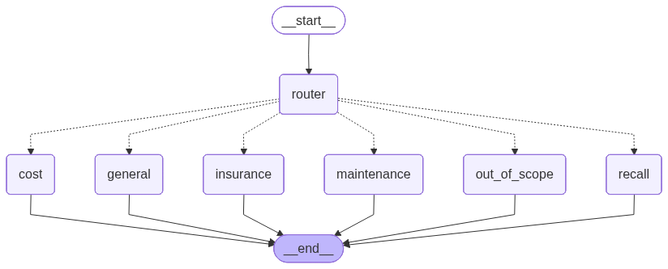

# 🚗 Car Ownership Copilot

A small but production-shaped **multi-agent system** built with **LangGraph** and **OpenAI**. A supervisor agent routes each user request to the right tool-using specialist — insurance, maintenance, recalls, or repair cost — and answers from "internal API" tools rather than from the model's memory.

I built this as a working illustration of the patterns behind an AI platform that automates car-ownership sales & service: routing, tool/function calling, a safety guardrail, human-in-the-loop confirmation, and per-turn latency/cost/accuracy instrumentation.

**🔗 Live demo:** _deploying to Streamlit Community Cloud — see [DEPLOY.md](DEPLOY.md)_ &nbsp;·&nbsp; bring your own OpenAI key (paste in the sidebar; never stored).



*Auto-generated from the compiled LangGraph (`build_graph().get_graph().draw_mermaid_png()`).*

```
                       ┌─────────────┐
            user ─────▶│  Supervisor │  (LLM router, structured output)
                       └──────┬──────┘
        ┌─────────────┬───────┼────────┬──────────────┬────────────────┐
        ▼             ▼       ▼         ▼              ▼                ▼
  🛡️ Insurance   🔧 Maintenance  ⚠️ Recalls   💲 Repair Cost   💬 General   🚫 Out-of-scope
   get_quote     get_schedule   lookup_recalls  estimate_cost   (no tools)   (guardrail,
                 book_appt*                                                    no LLM call)
        └─────────────┴───────────────┴──────────────┴───────────────┘
                                  ▼
                            final answer  +  {route, latency, tokens, $cost}

   * book_appt requires explicit user confirmation (human-in-the-loop)
```

## Why these design choices

| Job requirement | How it shows up here |
|---|---|
| *"LLMs, agents, and internal APIs to automate…"* | Supervisor + 4 specialist agents, each calling typed mock tools (`car_copilot/tools.py`) that stand in for Jerry's quoting / scheduling / recall / pricing services. |
| *"design prompt strategies, evaluation frameworks, and guardrails"* | Structured-output router, an `out_of_scope` **guardrail** that answers with no LLM call, and a routing-accuracy **eval** (`evals/`) that exits non-zero below 85% so it can gate CI. |
| *"balancing latency, cost, and accuracy"* | Every turn reports route, **latency (ms)**, **token count**, and an **estimated $ cost**; default model is `gpt-5.4-mini` for speed/cost, with `gpt-5.5` selectable for harder reasoning. |
| *"human-in-the-loop feedback"* | `book_service_appointment` only fires after the user explicitly confirms the service and date. |

## Verified (live run, `gpt-5.4-mini`)

Routing eval: **14/14 = 100%** (`python -m evals.run_eval`). End-to-end behavior, with the per-turn metrics the system reports:

| Scenario | Route | Behavior | Latency | Cost |
|---|---|---|---|---|
| "Insurance for my 2019 Civic, ZIP 94107, age 23" | `insurance` | Called the quote tool → 3 carrier quotes | ~3.0 s | $0.0015 |
| "Any recalls on a 2019 Honda Civic?" | `recall` | Found campaign 19V-001 (fuel pump) | ~2.3 s | $0.0013 |
| "Brake pads on a BMW 3 Series?" | `cost` | $210–$420 (luxury markup applied) | ~2.2 s | $0.0012 |
| "Book an oil change for my RAV4" → "Yes" | `maintenance` | Asked to confirm first, **then** booked (JRY-…) | ~3.3 / 2.1 s | $0.0016 / $0.0015 |
| "What's the weather in Paris?" | `out_of_scope` | Guardrail reply, no specialist call | ~0.8 s | $0.0003 |

*Mock data only — no real quotes, bookings, or recall lookups are performed.*

## Quickstart

```bash
python3.12 -m venv .venv && source .venv/bin/activate
pip install -r requirements.txt
cp .env.example .env          # then add your OPENAI_API_KEY

# Web UI (best for a demo)
streamlit run app.py

# …or terminal chat
python cli.py

# Verify wiring without an API key
python smoke_test.py

# Routing-accuracy eval (needs API key)
python -m evals.run_eval
```

## Try these

- *"I'm 23, my 2019 Honda Civic is in 94107 — what would insurance run me?"* → **insurance**
- *"My RAV4 has 47,000 miles. What's coming up?"* → **maintenance**
- *"Any open recalls on a 2019 Honda Civic?"* → **recall**
- *"How much should brake pads cost on a BMW 3 Series?"* → **cost**
- *"What's the weather in Paris?"* → **out_of_scope** (guardrail)

## Project layout

```
car_copilot/
  graph.py      supervisor graph, routing, run_turn() with latency/cost/token metrics
  agents.py     specialist definitions + the bounded ReAct tool loop
  tools.py      mock "internal API" tools (quote, schedule, recalls, cost, booking)
  state.py      LangGraph state (messages + route + model)
  config.py     model + pricing config
  llm.py        ChatOpenAI factory
app.py          Streamlit chat UI
cli.py          terminal chat
evals/          labeled routing cases + accuracy harness
smoke_test.py   offline structural test (no API key)
```

## How it works

1. **Route.** The supervisor (`gpt-5.4-mini`, `temperature=0`, structured output) reads the whole conversation and returns one of six destinations.
2. **Specialize.** The chosen specialist runs a bounded tool-calling loop: decide → call tool → read result → answer. Only the final answer is written to shared state, so intermediate tool chatter never pollutes context.
3. **Guard.** Off-topic requests short-circuit to a static reply — no model call, so it's instant and free.
4. **Measure.** A callback accumulates token usage across every LLM call in the turn; cost is derived from a per-model price table.

## What I'd build next (toward production)

- **LLM-as-judge eval** on answer quality, not just routing; expand the eval set from real misroutes.
- **Streaming** token output + tool-call traces in the UI for transparency.
- **Persistence / memory** via LangGraph checkpointers for multi-session continuity.
- **Observability** (LangSmith / OpenTelemetry) and a fallback model on timeout for the latency/cost SLA.
- **Real connectors** swapped in behind the same tool contracts — the agents don't change.

---

Built with LangGraph + OpenAI. Mock data only; no real quotes, bookings, or recall lookups are performed.
